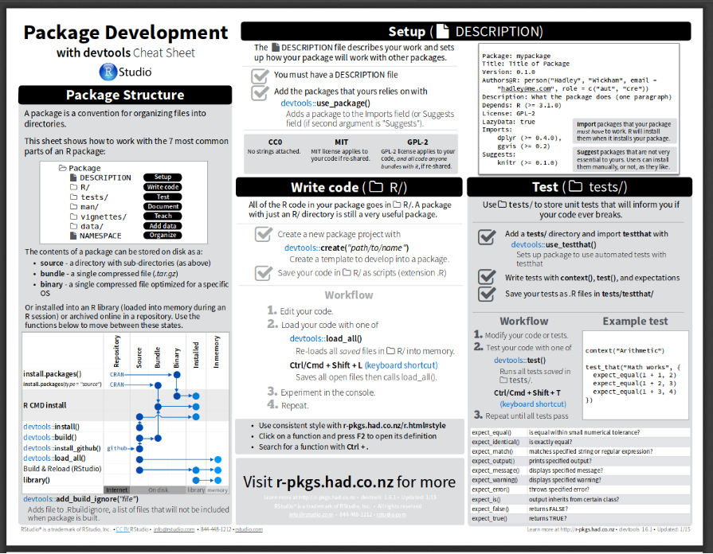
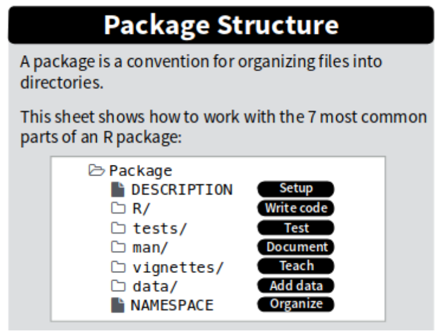
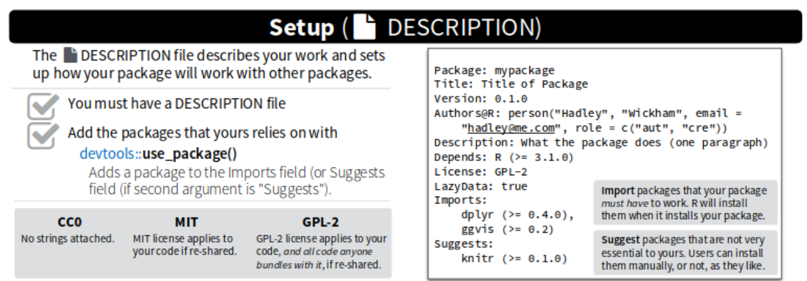
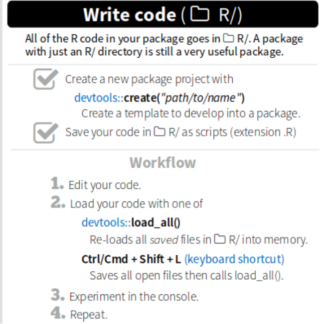
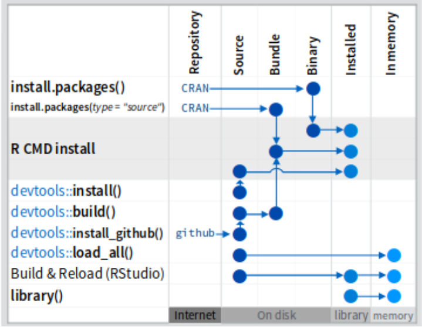
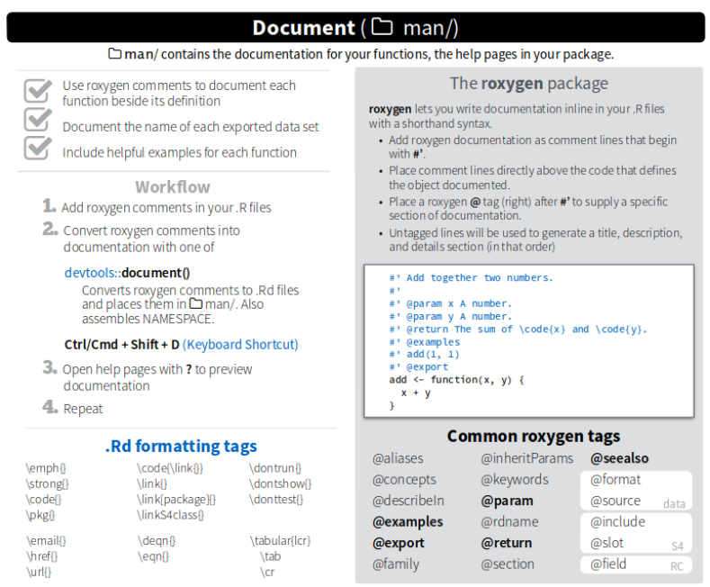
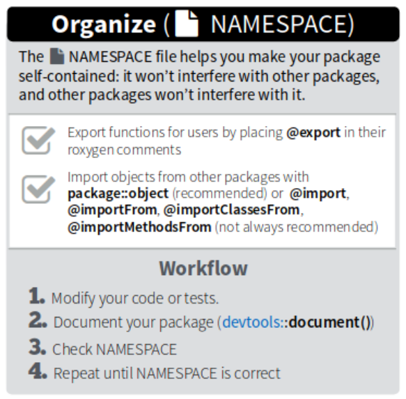
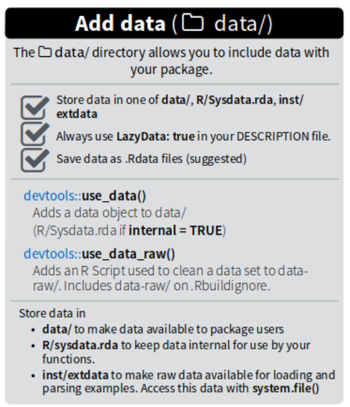
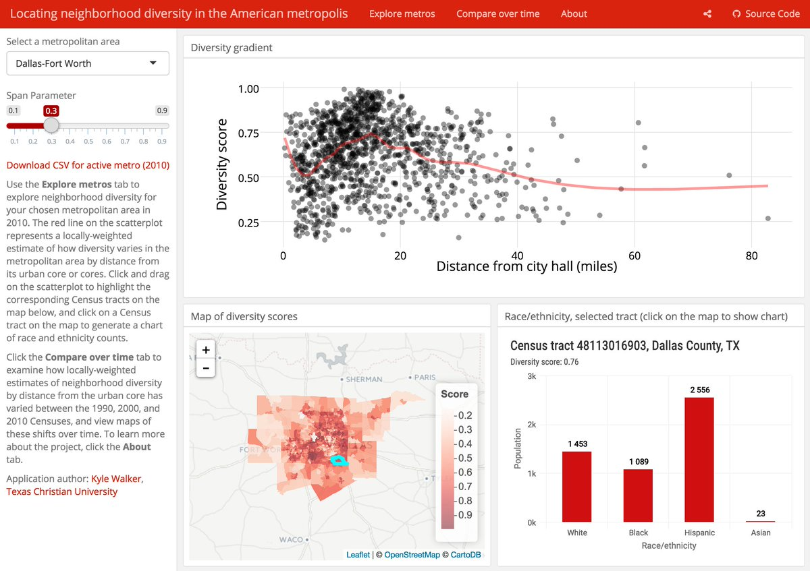

name: intro
class: spaced 

```{r,echo=FALSE,message=FALSE,warning=FALSE,results='hide'}
# run setup code

# load libraries ---------------------------------------------------------------
library(knitr) # runs pandoc
library(bookdown) # for markdown
library(captioner) # for table and figure captions

suppressPackageStartupMessages(library(tidyverse))

# knitr options ----------------------------------------------------------------

knitr::opts_knit$set(progress=TRUE,verbose=TRUE)
knitr::opts_chunk$set(dev="CairoPNG",results="hold",fig.show="hold",fig.align="left",echo=TRUE,warning=FALSE,message=FALSE)
```

```{r,echo=FALSE,message=FALSE,warning=FALSE}
# load the packages you need

#library(tidyverse)
#library(ggplot2) # static graphics
```

## Sharing data, code and analysis
* Packages (data and code)
* Interactive plots


---

## What is an R package?


---
## What is an R package?

* A directory containing a specific file structure

* A way of transferring functions, data and code

* An efficient, well documented analysis or method


---

## What is an R package?

* Efficient

* Improvable

* **Reproducible**


---



[LINK TO THE CHEAT SHEET](devtools-cheatsheet.pdf)
---




---
## Initialize an r package in Rstudio:

1. File - New project
2. New Directory
3. New R package
4. Add name and description
5. OK

## Make connection to github

1. Open git-hub:
2. New repository
3. Follow instructions from git-hub

---


---

---




---

---



---


---

## README.md file

This is what the users will see when the enter Git Hub:

* Short (or long) description of the package.

* How to install the package?

* What are the dependencies of the package?

---
## Make your packege available on GitHub!

* git add *

* git commit -m 'I just wrote a cool package.'

* git push

---

## Install others packages from github

```{r, eval=FALSE}
devtools::install_github("repository")
```

---

## Other resources

[R Packages book](http://r-pkgs.had.co.nz)


---

## Interactive plots


---
## Plotly

The function ggplotly converts a ggplot object to an HTML widget

```{r}
library(tidyverse)
library(plotly)


```
---
## Plotly


```{r}
plot <- ggplot(iris, aes(x=Sepal.Length, y=Petal.Length)) +
  geom_point(aes(color=Species))
plot
```
---
## Plotly


```{r}

plot <- ggplot(iris, aes(x=Sepal.Length, y=Petal.Length)) +
  geom_point(aes(color=Species))
ggplotly(plot)
```

---
## Flexdashboard

[Example flexdash](https://walkerke.shinyapps.io/neighborhood_diversity/)


---
## Resources:

[FlexDashboard](https://rmarkdown.rstudio.com/flexdashboard/)

[Shiny](https://shiny.rstudio.com/)

[Plotly](https://plot.ly/)

---
```{r}
R.version
```

---
name: end-slide
class: end-slide

# Thank you