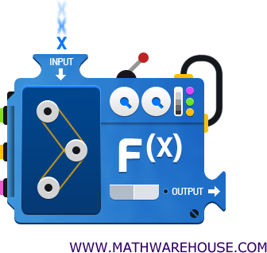

name: intro
class: spaced 

```{r,echo=FALSE,message=FALSE,warning=FALSE,results='hide'}
# run setup code

# load libraries ---------------------------------------------------------------
library(knitr) # runs pandoc
library(bookdown) # for markdown
library(captioner) # for table and figure captions

suppressPackageStartupMessages(library(tidyverse))

# knitr options ----------------------------------------------------------------

knitr::opts_knit$set(progress=TRUE,verbose=TRUE)
knitr::opts_chunk$set(dev="CairoPNG",results="hold",fig.show="hold",fig.align="left",echo=TRUE,warning=FALSE,message=FALSE)
```

```{r,echo=FALSE,message=FALSE,warning=FALSE}
# load the packages you need

#library(tidyverse)
#library(ggplot2) # static graphics
```


## Do you use functions when coding?


```{r}
sqrt(4)
```

```{r}
print("Hello World")
```

```{r}
data.frame(x=numeric(), y=factor())
```
```{r}
c(1,2,3,4,5)
```

---
name: General structure

## What is needed?

* Input: X1, X2, X3, X3
* Function: f()
* Output: y <-




---
name: Different types

## What is needed?

* output <- function(X1, ..., Xn)

```{r}
output <- sqrt(2)
```


---
name: What goes in?

## What goes into the function?

### Who decides what can go in?
### Who descides what comes out?


???

YOU Decide!

---
name: why?


## Why do we need to know how to write our own functions?

* Only possible solution?

* Writing your own package?

* Easier to interpret "Help" files.

* Good coding practice - Makes code readable

---
name: syntax1

## SYNTAX: How are functions defined?

* Definition


```{r}
name_of_function <- function(input1, input2, inputn) {
  
  "Do something"
  
}
```

---
name: example1

## SYNTAX: How are functions defined?

* Example

```{r}

sum_of_three <- function(a, b, c) {
  
  print( a + b + c)
  
}

```

```{r}
sum_of_three(a=3,b=4,c=5)
```


---

## SYNTAX: How are functions defined?

* Example
* Default inputs

```{r}

sum_of_three <- function(a=3, b=3, c=3) {
  
  print( a + b + c)
  
}

```

```{r}
sum_of_three(a=3)
```
---
name: exc1

## First excercise


[CONTINUE TO EXCERCISES](../functionsexc.html)


---
## Return objects, not printed to the console


```{r}
name_of_function <- function(input) {
  
  output <- input
  
  return(output)
  
}
```


---
## Error message


```{r}
normalizeR <- function(inputvector) {
  
  if (class(inputvector) != "numeric") {
    stop("Input is not a numeric vector")
    }
  
  normalized <- inputvector/mean(inputvector)
  
  return(normalized)
}
```

---
## Wrapper functions

* Change default settings of others functions

* Combine many functions in one

```{r}
mean_noNA <- function(x) {
  
    return(mean(x, na.rm = T))
  
}
```

---
## Wrapper functions

* Don't forget to add flexibility to the function

```{r}
mean_noNA <- function(x) {
    return(mean(x, na.rm = TRUE))
}
```

```{r}
mean_noNA <- function(x, na.rm= TRUE) {
    return(mean(x, na.rm = na.rm))
}
```

```{r}
mean_noNA <- function(x, na.rm= TRUE, ...) {
    return(mean(x, na.rm = na.rm, ...))
}
```


---
## Name spaces

* Functions uses their own namespaces
* Objects created inside the function cannot be available outside the function:

```{r}
x <- 10

helloR <- function() {
    
    x <- 15
    print("Hello World")

}
```

```{r}
helloR()
```

```{r}
print(x)
```
---
## Name spaces

* Functions uses their own namespaces
* Objects created inside the function cannot be available outside the function
*Object created outside the function can eventually be accessed from inside. AVOID THIS!


```{r}
x <- 10

helloR <- function() {
    
    print(x)
    print("Hello World")

}

helloR()
```
---

## Now - more excercices:

[CONTINUE TO EXCERCISES](../functionsexc.html)

---
name: report

## Session Info

```{r,echo=TRUE}
R.version
```

---
name: end-slide
class: end-slide

# Thank you


