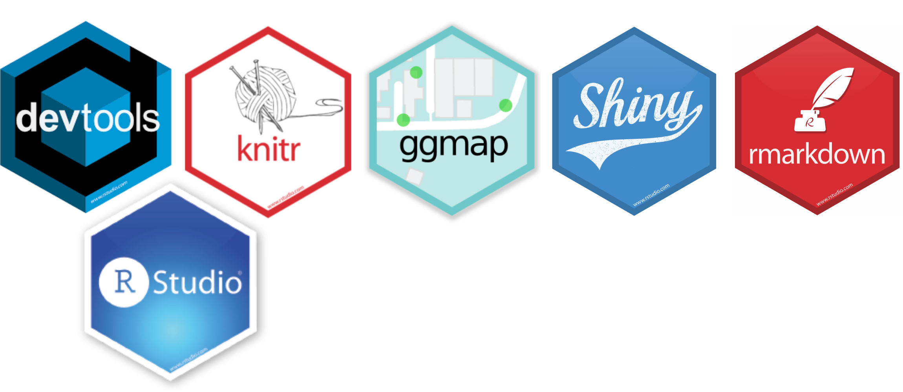

# WELCOME TO THE WORKSHOP HOMPAGE!

## Schedule and course materials

**Tuesday**

9.00 - 9.30     Introduction to the workshop by Malie

9.30 - 10.30    [Reproducible research with RMarkdown](ElsasFiles/DevelopingSkillsInR_ReprResearch_ElsaF.html) by Elsa, TA: Julie, Malie [Example report](ElsasFiles/ExampleReport.html)

10.30 - 11:00   Coffee break

11.00 - 12.00   RMarkdown ctd.

12.00 - 13.00   Lunch

13.00 - 14.30   [Git, Website and Presentation in RMarkdown](MarcosFiles/GitWebRma.html) by Marco, TA: Julie, Malie

14.30 - 15.00   Coffee break

15.00 - 17.00   [Good coding practices](MaliesFiles/Pres_good_coding_practices_MLT.html) by Malie, TA: Andreas

**Wednesday**

9.00 - 10.30    Functions and wrappers by Andreas, TA: Malie

10.30 - 11.00   Coffee break

11.00 - 12.00   Rpackages to share data and code by Andreas, TA: Malie

12.00 - 13.15   Lunch

13.15 - 14.30   [Maps in R](MaliesFiles/Maps_in_R_MLT.html) by Malie, TA: Julie

14.30 - 15.00   Coffee break

15.00 - 16.15   Ggmap ctd.

**Thursday**

9.00 - 10.30    Interactive figures (plotly, shiny etc.) by Andreas, TA: Julie and Malie

10.30 - 11.00   Coffee break

11.00 - 11.30   Interactive figures ctd.

11.30 - 12.00   [Feedback sheets fill up](MaliesFiles/Feedback.html)

12.00 - 13.15   Lunch

13.15 - 14.30   Q&A, Finishing excercis, backup time, Malie, Andreas, Marco and Elsa.

14.30 - inf.    Coffee

**Everything on this website was coded in R.** [**Check out how**](https://github.com/deepskillsr/deepskillsr.github.io)

